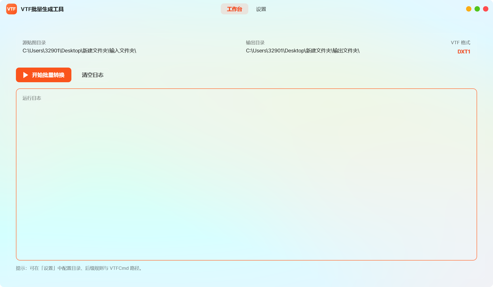
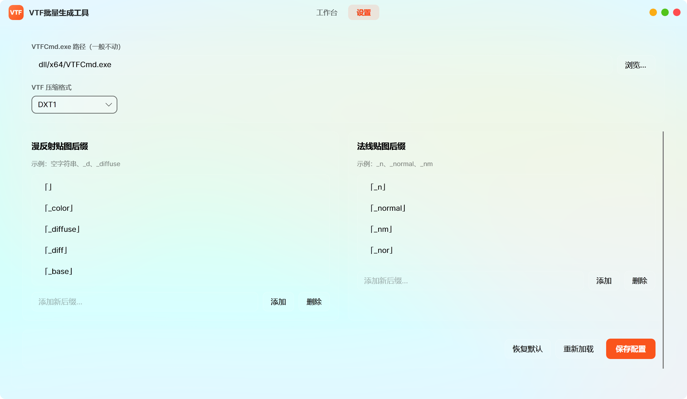

# Source 1 Engine VTF/VMT Generator

一个用于批量生成 Source 1 引擎 VTF 贴图与 VMT 材质文件的工具。

支持根据源文件夹中的贴图自动识别材质类型，保持原有目录结构，并生成对应的 VTF 与 VMT 文件，适用于《求生之路 2》、《军团要塞 2》、《Garry's Mod》等基于 Source 1 引擎的游戏。

---

## 功能特性

- 批量转换 PNG、JPG、TGA、BMP 等贴图为 VTF 文件
- 自动生成对应 VMT 材质文件
- 保持源文件夹目录结构
- 自动识别漫反射贴图（Base Color）
- 自动识别法线贴图（Normal Map）
- 支持自定义贴图后缀规则
- 支持自定义 VMT 模板
- 支持直接输出到游戏资源目录

---

## 截图




---
## 系统需求

- Windows 64 位操作系统
- Windows 10 / Windows 11

---

## 使用说明

```text
更改设置后一定要保存才会生效！设置界面滚动到底部有保存按钮！！！
```

### 1. 设置源文件夹

首次运行时需要指定源文件夹。

源文件夹中存放用于转换的贴图资源，程序会扫描该目录及其所有子目录，并按照原有目录结构生成对应文件。

例如：

```text
Source
├─ Weapon
│  ├─ ak47_color.png
│  └─ ak47_normal.png
└─ Props
   └─ crate_color.png
```

生成后：

```text
Output
├─ Weapon
│  ├─ ak47.vtf
│  ├─ ak47_normal.vtf
│  └─ ak47.vmt
└─ Props
   ├─ crate.vtf
   └─ crate.vmt
```

---

### 2. 设置输出文件夹

首次运行时需要指定输出目录。

推荐在游戏主目录中创建独立资源文件夹（例如 `asset`），然后在 `gameinfo.txt` 中将该目录加入搜索路径。

这样可以：

- 集中管理自定义资源
- 避免修改游戏原始文件
- 方便后续打包和发布
- 降低资源冲突风险

---

### 3. 保留程序依赖文件

程序目录中的 DLL 文件为 VTF 生成所需组件。

请勿删除、移动或重命名这些文件，否则程序可能无法正常工作。

---

### 4. 贴图命名规则

程序通过文件后缀识别贴图类型。

默认规则：

| 文件名 | 识别类型 |
|----------|----------|
| weapon_color.png | 漫反射贴图 |
| weapon_normal.png | 法线贴图 |

后缀规则可在软件设置中自行修改或扩展。

---

### 5. 贴图尺寸要求

Source 引擎要求贴图尺寸为 2 的幂次方。

支持的常见尺寸：

```text
16
32
64
128
256
512
1024
2048
4096
```

如果存在不符合要求的贴图会报异常。

---

## 已支持的贴图类型

目前支持：

- 漫反射贴图（Base Color）
- 法线贴图（Normal Map）

---

## 已知限制

### 1. 贴图类型支持有限

当前版本仅自动识别：

- Base Color
- Normal Map

这是考虑到这是最常用的组合

---

### 2. 大批量资源转换速度较慢

VTF 生成过程依赖外部工具。

当贴图数量较多时，转换时间会明显增加。

建议：

- 将已处理完成的资源移出源目录
- 分批次进行转换
- 避免重复扫描大量历史资源

---

### 3. 文件格式支持

当前仅扫描以下格式：

```text
.png
.jpg
.jpeg
.tga
.bmp
```

对于 Source 引擎素材制作流程而言，这些格式已经能够满足绝大多数需求。

---

### 4. 透明贴图处理

由于 VTF 压缩格式限制：

- 普通贴图推荐使用 DXT1
- 含 Alpha 通道贴图推荐使用 DXT5

如果不介意额外的文件体积，可以统一使用 DXT5 进行生成，以简化工作流程，但不推荐。

---

### 5. 无自动缩放功能

程序不会自动调整贴图分辨率。

生成后的 VTF 分辨率与原始贴图保持一致。

例如：

```text
1024 × 1024 → 1024 × 1024
2048 × 2048 → 2048 × 2048
```

---
